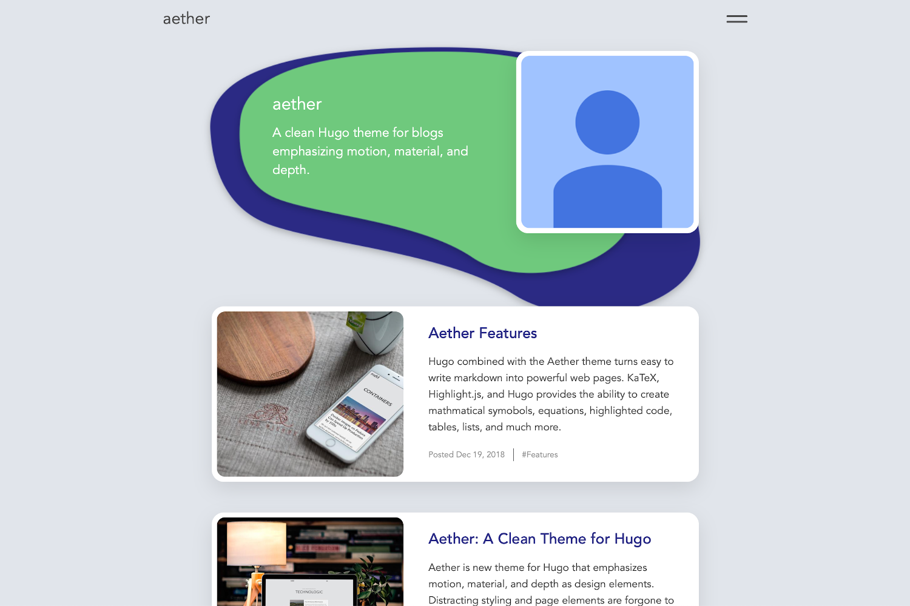

# aether
Aether is a Hugo theme for blogs that emphasizes motion, depth, and material as design elements.  Aether presents your content in a clean interface that highlights good photography and writing.

## Features
 - Content is displayed in cards that use movement and depth
 - Category pages that group similar articles are automatically generated and added to the menu
 - Customizable website background image and home button image
 - Looks good on any screen using responsive web design
 - Highlight.js integration provides beautiful syntax highlighting for most programming languages and file formats



## Installation
In your Hugo project's theme directory, clone the Aether repo.

```bash
git clone https://github.com/josephhutch/aether.git
```

Set the theme to aether in the config file.

## Usage
### Website Configuration
Aether provides multiple ways to custimize the look and feel of the theme through the config.toml file. See how to fill in the config file below.
```toml
baseURL = "https://yourwebsitenamegoeshere.com/"
languageCode = "The language code for the language the website is written in"
title = "The website title that is used in each page title, displayed in the browser tab and search results"
theme = "aether"

[params]
brand = "The name that is displayed in the top left of the website, consider it the website name"
description = "The website's description"
homeimg = "URL to the image used for the home button at the bottom of each post - optional"
bgimg = "URL to the image used for the page background - optional"
```

### Creating content
Make a new post by executing `hugo new post/postnamehere.md` in your shell. Open the new file, update the front matter, and start writing! Below you can find what the front matter should contain for a new post and what each of the parameters mean.
```yaml
title: "The title of your post"
date: date the post was generated
description: "Description of the post (displayed in the post's card)"
categories: ["Add comma seperated categories here", "another category"]
featuredImage: "URL to the page's featured image, used as the card image and the image at the top of the article"
displayInMenu: whether you would like the post to show up in the navigation menu (true, false)
displayInList: whether you would like the post to be listed on the home page and category pages (true, false)
draft: if the page is a draft (true, false)
```

Posts typically would have displayInMenu set to false so that the post is not a menu option, and displayInList set to true so it shows up on the homepage's list of posts and in category page lists. An About Me page or a Contact page, on the other hand, would want displayInMenu set to true and displayInList set to false.  That will allow the About Me page or Contact page to be accessable from the menu but not displayed in the homepage's list of posts.

Adding an interesting description and a good image to each post is a great way to get the most value out of this theme.

### Further Customization
To change the heading and subtext at the top of list pages just add a \_index.md file in the folder that the list page is generated from.  For example to change the heading at the top of the homepage, add an \_index.md file to the content folder with the following parameters.
```yaml
---
title: "This is the main heading text in big letters"
date: the date
description: "This is the subtext above the main heading in small letters"
---
```

## Helpful Links
[Hugo Documentation](https://gohugo.io/documentation/) - Learn how to use Hugo and format content files

## License
MIT © Joe Hutchinson
